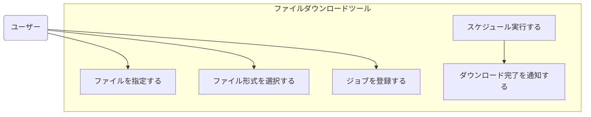

# ファイルダウンロード用コマンドツールの仕様

この仕様は、ファイルストレージから特定のファイルをダウンロードするためのコマンドツールについて説明するものです。

## ユースケース

---

## 全体構成

- **ローカル環境**
  - コマンドツール
  - ローカルサーバー
  - ダウンロードコマンド

- **ネットワーク先**
  - ファイルストレージ

---

## 処理の流れ

1. ### ユーザーによるファイル指定  
   コマンドツールを使って、ファイルストレージ上の特定リソースにあるファイルを指定します。

2. ### ファイル形式の確認と選択  
   コマンドツールは、指定されたリソースに存在するファイル形式を確認し、ユーザーが形式を選択できるようにします。

3. ### ジョブの登録  
   ユーザーがファイル形式を選択すると、コマンドツールはローカルサーバーに対し、ダウンロードコマンドを使った「ファイルダウンロード処理」をジョブとして登録します。

4. ### コマンドツールの終了  
   ジョブの登録が完了した時点で、コマンドツールは終了します。

5. ### ファイルのダウンロード  
   登録されたジョブは、スケジュールに従ってダウンロードコマンドを実行し、ファイルを取得します。

6. ### 完了通知  
   ダウンロードが完了した後は、何らかの方法でユーザーに通知を行います。

---

## 備考

- 通知の方法（例：ログ、メール、UI上の表示など）
- ファイル形式の種類
- ジョブスケジューリングの詳細

これらは必要に応じて別途仕様として追加することが可能です。

