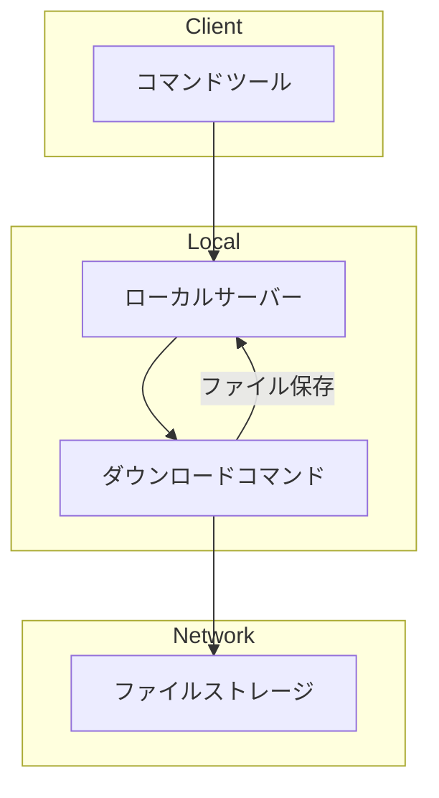
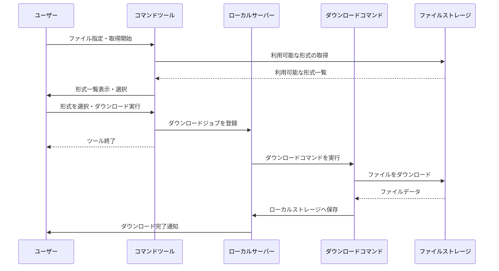
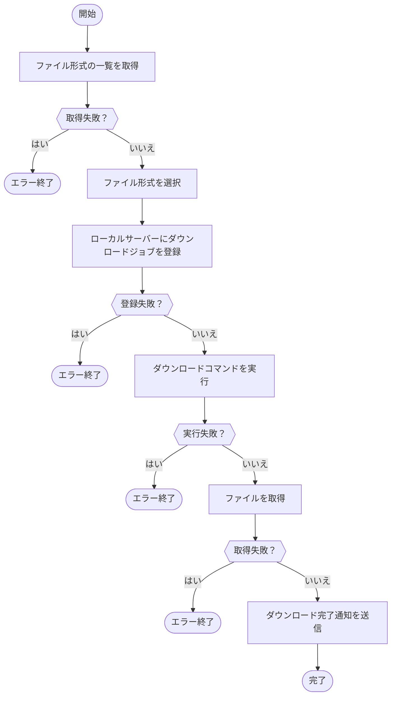

# ファイルダウンロード用コマンドツール - システム仕様図

---

## コンポーネント図

```mermaid
%% コンポーネント図
graph TB
  subgraph Client
    CommandTool[コマンドツール]
  end

  subgraph Local
    LocalServer[ローカルサーバー]
    DownloadCommand[ダウンロードコマンド]
  end

  subgraph Network
    FileStorage[ファイルストレージ]
  end

  CommandTool --> LocalServer
  LocalServer --> DownloadCommand
  DownloadCommand --> FileStorage
  DownloadCommand -->|ファイル保存| LocalServer
```

---

## シーケンス図

```mermaid
%% シーケンス図
sequenceDiagram
    participant User as ユーザー
    participant CT as コマンドツール
    participant LS as ローカルサーバー
    participant DC as ダウンロードコマンド
    participant FS as ファイルストレージ

    User ->> CT: ファイル指定・取得開始
    CT ->> FS: 利用可能な形式の取得
    FS -->> CT: 利用可能な形式一覧
    CT ->> User: 形式一覧表示・選択
    User ->> CT: 形式を選択・ダウンロード実行
    CT ->> LS: ダウンロードジョブを登録
    CT -->> User: ツール終了
    LS ->> DC: ダウンロードコマンドを実行
    DC ->> FS: ファイルをダウンロード
    FS -->> DC: ファイルデータ
    DC ->> LS: ローカルストレージへ保存
    LS ->> User: ダウンロード完了通知
```

---

## アクティビティ図

```mermaid
flowchart TD
  start([開始])
  checkFormat["ファイル形式の一覧を取得"]
  formatError{{"取得失敗？"}}
  endError1([エラー終了])
  chooseFormat["ファイル形式を選択"]
  registerJob["ローカルサーバーにダウンロードジョブを登録"]
  registerError{{"登録失敗？"}}
  endError2([エラー終了])
  runDownload["ダウンロードコマンドを実行"]
  runError{{"実行失敗？"}}
  endError3([エラー終了])
  getFile["ファイルを取得"]
  getFileError{{"取得失敗？"}}
  endError4([エラー終了])
  notify["ダウンロード完了通知を送信"]
  endSuccess([完了])

  start --> checkFormat --> formatError
  formatError -- いいえ --> chooseFormat
  formatError -- はい --> endError1
  chooseFormat --> registerJob --> registerError
  registerError -- はい --> endError2
  registerError -- いいえ --> runDownload --> runError
  runError -- はい --> endError3
  runError -- いいえ --> getFile --> getFileError
  getFileError -- はい --> endError4
  getFileError -- いいえ --> notify --> endSuccess
```