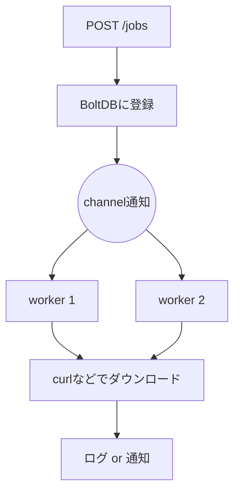

# ローカルサーバーの実装仕様書

## 概要

このサーバーは、ファイルダウンロード用のジョブを外部のコマンドツールから登録・管理し、指定した並列数でバックグラウンド実行します。

## 技術スタック

- 実装言語: Go
- データベース: BoltDB (bbolt)
- 並列実行制御: Goのchannel
- API設計: RESTful Web API

## 機能概要

### ジョブ登録用 RESTful API

コマンドツールからジョブを登録するために、RESTful API を提供します。

- `POST /jobs`
  - 内容: ダウンロード対象のURL、保存先パス、形式などを含むジョブをJSONで登録。
  - 処理: 受け取ったジョブをBoltDBのqueueに格納。
  - レスポンス: 登録成功のメッセージまたはエラーメッセージを返却。

### バックグラウンドジョブ実行

- 起動時にワーカープロセスを指定した数（デフォルト: 2）立ち上げます。
- 各ワーカーは BoltDB の queue からジョブを取得し、ダウンロードコマンドを実行します。
- ジョブの成功・失敗結果はログに出力され、必要に応じて通知機構を追加可能です。

### 並列処理

- Go の `goroutine` と `channel` を使用して複数のジョブを並列に処理。
- 処理数は起動オプションまたは設定ファイルから変更可能。

## アーキテクチャ

- サーバープロセスは単一のバイナリとして動作。
  - REST APIサーバー
  - バックグラウンドワーカー群（goroutineベース）
- 同一プロセス内で API 処理とジョブ実行処理を非同期・並列に実行。

## 拡張性

- ジョブ状態のトラッキング機構を追加可能（実行中・成功・失敗など）。
- 完了通知のためのWebhookやメール送信機能の追加が容易。
- ワーカー数やキューの最大容量などを設定ファイルまたはCLI引数でカスタマイズ可能。
