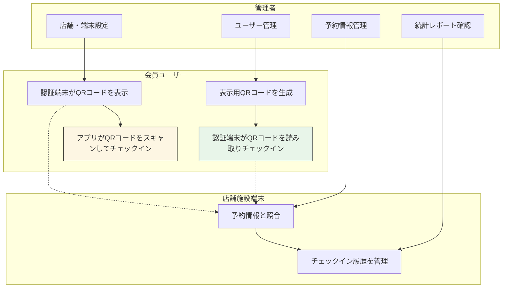
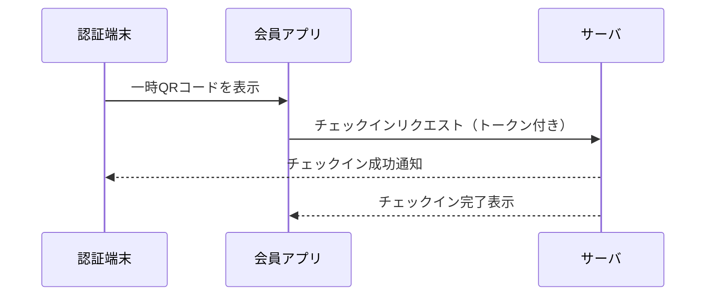
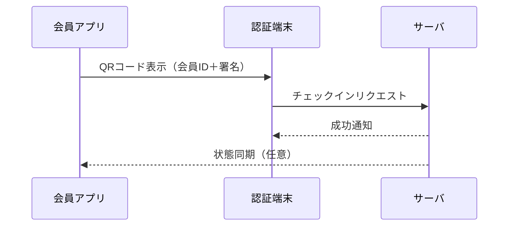

# 会員証アプリおよびチェックインシステム 要件定義

本ドキュメントは、**会員証アプリ**と**チェックインシステム**の機能要件・非機能要件・連携要件について整理したものです。  
チェックイン方法として、以下の2方式に対応します。

- パターンA：**認証端末がQRコードを発行し、会員アプリがスキャンしてチェックイン**
- パターンB：**会員アプリがQRコードを発行し、認証端末がスキャンしてチェックイン**

---

## 📌 ユースケース図（Mermaid Diagram）

---

## ✅ 機能要件

### 会員アプリ（ユーザー側）

- 会員証表示（会員ID、氏名、有効期限など）
- チェックイン履歴の表示
- 予約情報の確認（連携時）
- パターンA対応：
  - 認証端末が表示するQRを読み取り、チェックインリクエストを送信
- パターンB対応：
  - 自身の会員情報を含むQRコードを生成し提示

---

### 認証端末（店舗・施設側）

- パターンA対応：
  - 一時トークンQRコードの生成と表示
  - 会員アプリからのチェックインリクエストを受信
- パターンB対応：
  - アプリのQRコードをスキャンし、サーバにチェックインリクエストを送信
- 共通：
  - 予約情報との照合（該当する場合）
  - チェックイン履歴の閲覧・検索

---

### 管理者機能

- ユーザー（会員）管理（登録・編集・無効化）
- 店舗・端末設定（名称、設置場所、営業時間など）
- 予約管理と連携確認
- チェックイン履歴の集計・出力
- チェックイン方式（A/B）ごとのログ管理

---

## 🔐 QRコード仕様例

| 用途 | 内容 | 有効期間 | 備考 |
|------|------|----------|------|
| 認証端末発行型 | 一時トークン（署名付き） | 数十秒～数分 | ワンタイム使用 |
| アプリ発行型 | 会員ID＋署名＋タイムスタンプ | 数分 | 店舗端末側で検証 |

---

## 🔄 外部連携要件

- 予約システムとのAPI連携
  - 予約内容の取得／同期／状態更新
  - チェックイン時の照合に使用
- ID認証サービスとの連携（LINE, Google, Apple など）

---

## 🛡️ 非機能要件

- セキュリティ
  - QRトークンは改ざん不可の署名付き（例：JWT, HMAC）
  - 有効期限管理、ワンタイムトークン化
- 可用性
  - 多拠点同時利用時の負荷耐性
- スケーラビリティ
  - NFC・BLE・顔認証などの将来的な拡張を考慮
- 対応環境
  - iOS / Android / タブレット / 店舗側PC・専用端末
- 多言語対応
  - UIの英語・日本語対応（観光施設などを想定）

---

## 🧪 チェックインフロー図（参考）

### パターンA（認証端末がQR提示）

---

### パターンB（アプリがQR提示）

---

## 📎 補足：オプション制限

- 営業時間外チェックイン制限
- 予約必須チェックイン制限
- 同一会員の同時複数拠点チェックイン制限
- サービス種別ごとのチェックイン制御

---

## 📂 今後の拡張項目

- 顔認証／生体認証との連携
- スマートロック・ゲートとの統合
- POSとの統合（来店ポイント処理など）

---
