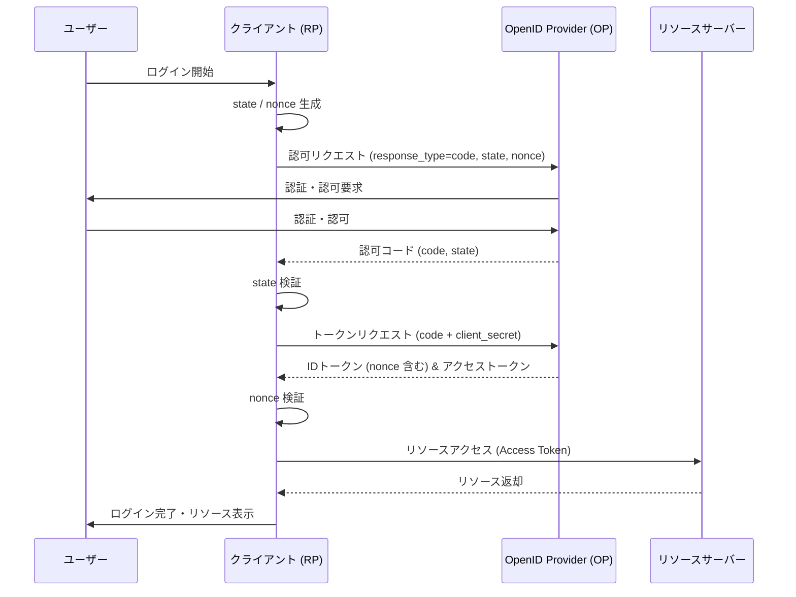
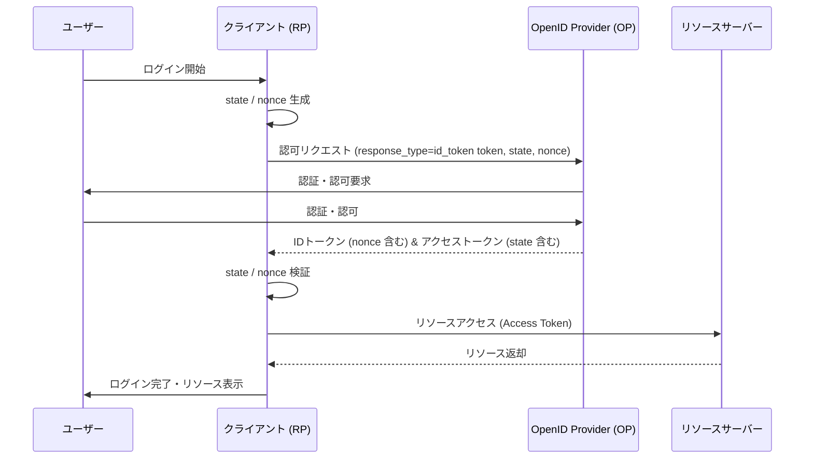
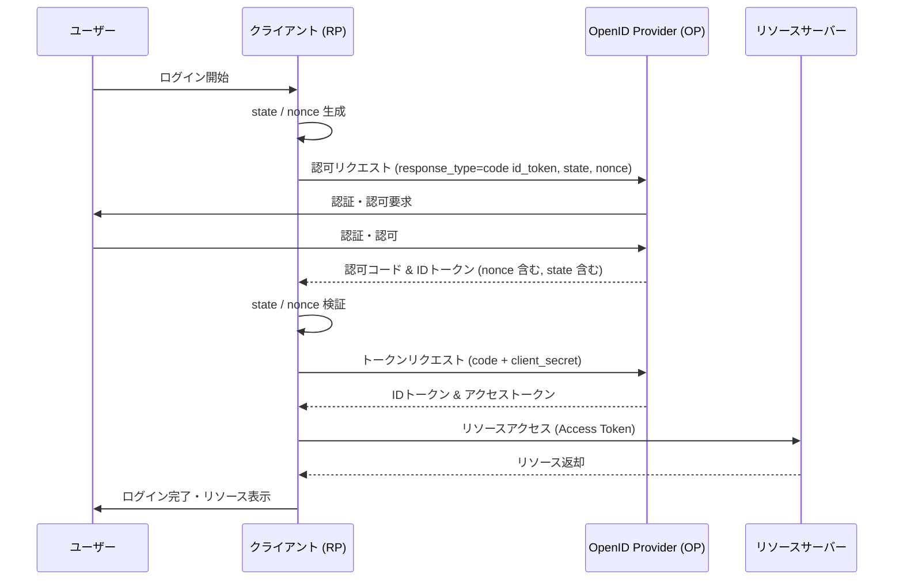
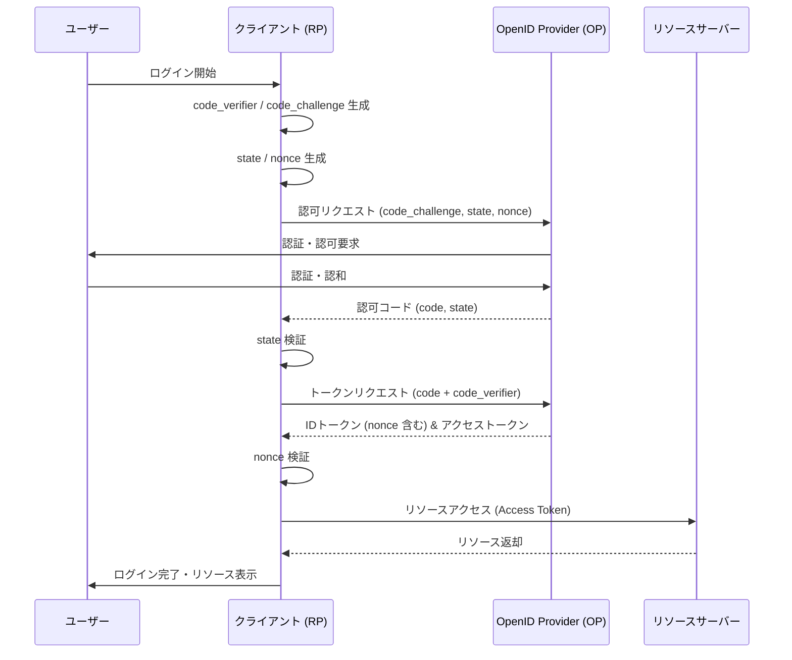

# OIDC (OpenID Connect) 概要

`memo.txt` に記載されている情報を基にした、OIDC 関連サービスおよび実装用ライブラリの概要です。

## 主要な OpenID Provider / Identity Provider サービス
OpenID Provider (OP) または Identity Provider (IdP) の機能を提供する主なサービス：

- **Auth0 (by Okta)**
- **AWS Cognito**
- **Firebase Authentication**
- **Okta Workforce Identity**

## 実装用ライブラリ
各プログラミング言語で OpenID Provider / Identity Provider 機能を実装するための主要なライブラリ：

| 言語 | ライブラリ名 | PKCE | State | Nonce | 特徴 |
| :--- | :--- | :---: | :---: | :---: | :--- |
| Python | Authlib | ✅ | ✅ | ✅ | オールインワンで使いやすく、ドキュメントが豊富。 |
| Java | Spring Auth Server | ✅ | ✅ | ✅ | Spring 生態系で構築するなら標準。エンタープライズ向け。 |
| Go | Ory Fosite | ✅ | ✅ | ✅ | セキュリティ強度が極めて高く、フルカスタマイズ向け。 |
| Ruby | Doorkeeper | ✅ | ✅ | ✅ | Rails との親和性が抜群。Gem 追加で OIDC 対応可能。 |
| TS/JS | oidc-provider | ✅ | ✅ | ✅ | 圧倒的な仕様準拠。Express/Koa などで動作。 |

## OIDC の主要な 4 つのフロー

### 1. Authorization Code Flow (認可コードフロー)
最も一般的でセキュアなフローです。サーバーサイドを持つアプリケーションで使用されます。

### 2. Implicit Flow (インプリシットフロー)
主に SPA などのフロントエンドのみのアプリで利用されていましたが、現在は PKCE 付与の認可コードフローが推奨されています。

### 3. Hybrid Flow (ハイブリッドフロー)
認可コードフローとインプリシットフローを組み合わせたものです。

### 4. Authorization Code Flow with PKCE (PKCE 付与認可コードフロー)
モバイルアプリや SPA で推奨される、クライアントシークレットを使用しないセキュアなフローです。

## IDトークンとアクセストークンの違いと利用用途

OIDC フローで取得される 2 種類のトークンは、その役割と送信先が明確に異なります。

| 特徴 | IDトークン (ID Token) | アクセストークン (Access Token) |
| :--- | :--- | :--- |
| **例え** | **身分証明書**（マイナンバーカード等） | **ホテルのカードキー** |
| **主な目的** | **「誰が」**ログインしたかを証明する（認証） | **「何が」**できるかの権限を与える（認可） |
| **主な送信先** | **クライアント (RP)** 自身が利用 | **リソースサーバー (RS)** へ送信 |
| **形式** | JWT (JSON Web Token) 形式が必須 | 形式は規定されていない（JWT が多い） |
| **中身の例** | ユーザーID(sub)、名前、メアド、発行者(iss)等 | スコープ(scope)、有効期限(exp)等 |

### IDトークン (ID Token)
- **用途:** クライアント（アプリ）側で、ログインしたユーザーの情報を取得・確認するために使用します。
- **検証:** クライアントは IDトークンの署名を検証し、ユーザーが正しく認証されたことを確認します。
- **注意:** **他のAPI（リソースサーバー）に送信してはいけません。** あくまでクライアント内でのユーザー識別用です。

### アクセストークン (Access Token)
- **用途:** ユーザーに代わって、保護されたリソース（APIなど）にアクセスするための「鍵」として使用します。
- **検証:** リソースサーバー（API側）がこのトークンを検証し、リソースへのアクセスを許可するか判断します。
- **注意:** クライアントはこのトークンの中身を解釈する必要はありません（不透明な文字列として扱うこともあります）。

## IDトークンの内部構造と主なクレーム

IDトークンは **JWT (JSON Web Token)** 形式であり、デコードすると主に「ヘッダー」「ペイロード」「署名」の3つのセクションで構成されています。

### 1. ヘッダー (Header)
トークンの種別や署名アルゴリズムが含まれます。
- `alg`: 署名アルゴリズム (例: RS256)
- `kid`: 署名検証に使用する公開鍵のID

### 2. ペイロード (Payload)
ユーザー情報やトークンの属性（クレーム）が含まれる JSON データです。

| クレーム | 名称 | 内容 |
| :--- | :--- | :--- |
| **iss** | Issuer | トークンの発行者 (IdP の URL) |
| **sub** | Subject | **ユーザーの一意な識別子** (アプリ内でのユーザーID) |
| **aud** | Audience | トークンの利用先 (クライアントID) |
| **exp** | Expiration Time | トークンの有効期限 (UNIXタイムスタンプ) |
| **iat** | Issued At | トークンの発行時刻 |
| **nonce** | Nonce | リプレイアタック防止用のランダムな文字列 |
| **email** | Email | ユーザーのメールアドレス（スコープによる） |
| **name** | Name | ユーザーの表示名（スコープによる） |

### 3. 署名 (Signature)
ヘッダーとペイロードをベースに、発行者の秘密鍵で作成された署名です。クライアントはこの署名を IdP の公開鍵で検証することで、内容が改ざんされていないことを保証します。

## セキュリティ対策: State と Nonce

OIDC のセキュリティを強化するために、フローの中で `state` と `nonce` という 2 つの重要なパラメータが使用されます。

### State (ステート)
- **役割:** CSRF (サイト間リクエスト偽造) 攻撃を防止します。
- **仕組み:**
    1. クライアントが認可リクエストを送信する際、ランダムな文字列 (`state`) を生成して保存し、IdP に送信します。
    2. IdP は認可レスポンスと共に、受け取った `state` をそのままクライアントに返します。
    3. クライアントは、戻ってきた `state` が最初に送信・保存したものと一致するか確認します。
- **目的:** 認証リクエストを開始したブラウザと、レスポンスを受け取ったブラウザが同一であることを保証します。

### Nonce (ノンス)
- **役割:** IDトークンのリプレイ攻撃（盗聴されたトークンの再利用）を防止します。
- **仕組み:**
    1. クライアントが認可リクエストを送信する際、ランダムな文字列 (`nonce`) を生成して保存し、IdP に送信します。
    2. IdP は発行する IDトークンのペイロード内に、受け取った `nonce` を埋め込みます。
    3. クライアントは、IDトークン内の `nonce` が最初に送信・保存したものと一致するか確認します。
- **目的:** その IDトークンが、特定の認可リクエストに対して発行された最新のものであることを保証します。

