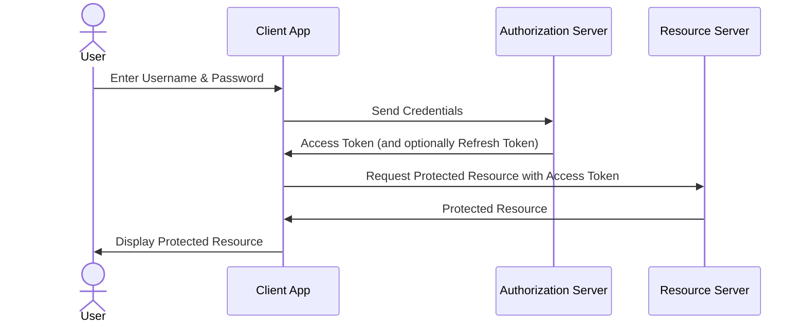

# OIDC リソースオーナーパスワードフロー

## フロー概要

リソースオーナーパスワードフロー（Resource Owner Password Credentials Grant, ROPC）は、ユーザーがクライアントアプリケーションに直接ユーザー名とパスワードを提供し、認可サーバーからアクセストークンを取得する方式です。

このフローは主に信頼されたクライアントアプリ（例: ネイティブアプリやCLIツール）で使用されますが、セキュリティ上の懸念から推奨されないことが多く、クライアントがユーザーの認証情報を直接扱うため注意が必要です。

## フローの流れ

## ステップ詳細

1. **ユーザーがクライアントアプリにユーザー名とパスワードを入力**
   - ユーザーは、認証情報をクライアントアプリに直接提供します。
   
2. **クライアントアプリが認可サーバーへ認証情報を送信**
   - クライアントアプリは、ユーザーの認証情報（ユーザー名・パスワード）を認可サーバーに送信します。
   
3. **認可サーバーがアクセストークンを発行**
   - 認可サーバーが認証情報を検証し、成功した場合はアクセストークン（必要に応じてリフレッシュトークンも）を発行します。
   
4. **クライアントアプリがリソースサーバーにリクエストを送信**
   - クライアントアプリは、取得したアクセストークンを使用して、リソースサーバーへ保護されたリソースのリクエストを送信します。
   
5. **リソースサーバーが保護されたリソースを返す**
   - リソースサーバーは、アクセストークンを検証し、有効であれば保護されたリソースをクライアントアプリに返します。
   
6. **クライアントアプリがユーザーにリソースを表示**
   - クライアントアプリは、取得したリソースをユーザーに表示します。

## 注意点

- **セキュリティリスク**: クライアントアプリがユーザーの認証情報を直接扱うため、セキュリティリスクが高まります。可能であれば、より安全なフロー（例: 認可コードフロー）を使用することが推奨されます。
- **リフレッシュトークンの利用**: アクセストークンの有効期限が切れた場合、リフレッシュトークンを使用して新しいアクセストークンを取得できます。

このフローを使用する場合は、クライアントの安全性を確保し、適切なセキュリティ対策を講じることが重要です。
